# SleepMonitor

该APP旨在能够便捷化实现睡眠监测功能，用户仅仅在睡觉时将手机放在床边就可监测其睡眠状态。  

SleepMonitor通过调用手机**麦克风**对夜间睡眠环境进行录音，内置鼾声识别模型，可以保存鼾声片段；通过**加速度**传感器对睡眠时体动进行监测，觉醒时体动明显，深睡时体动变化较小，实现觉醒/浅睡/深睡的简单分类。未来会更一步对睡姿进行监测。  

SleepMonitor支持睡眠报告的查看，数据的删除等功能。

## 功能

- 鼾声识别
- 睡眠阶段分期
- 睡眠报告
  - 生成当日报告
  - 近5日睡眠报告
  - 查看指定日期睡眠报告
- 数据删除
- 闹钟
  - 设定时间的唤醒
  - 轻唤醒
  - 10分钟后再响

## 界面展示

### 主页

 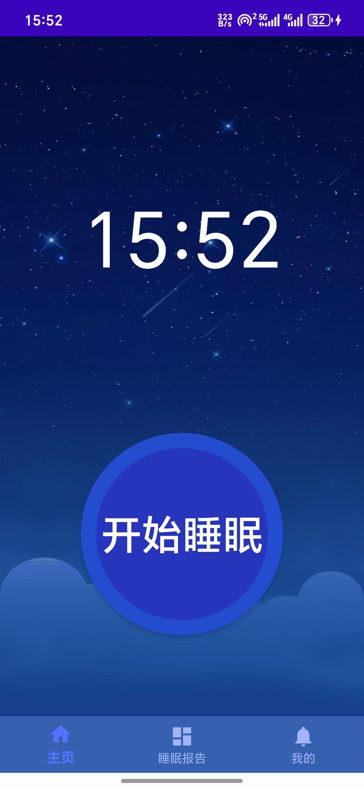
 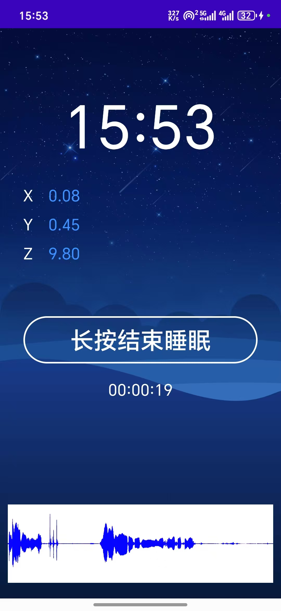

其中睡眠监测界面（右图）能够显示时间（TextView）、加速度传感器数值（TextView）、计时器（TextView）和声音波形图（surfaceView）。  

## 睡眠报告

+ 日报告

 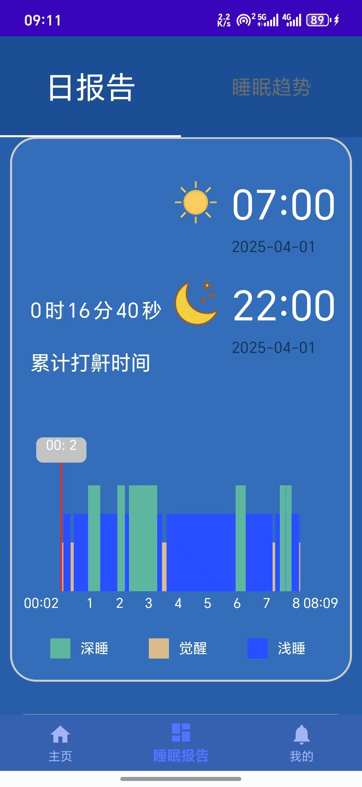
 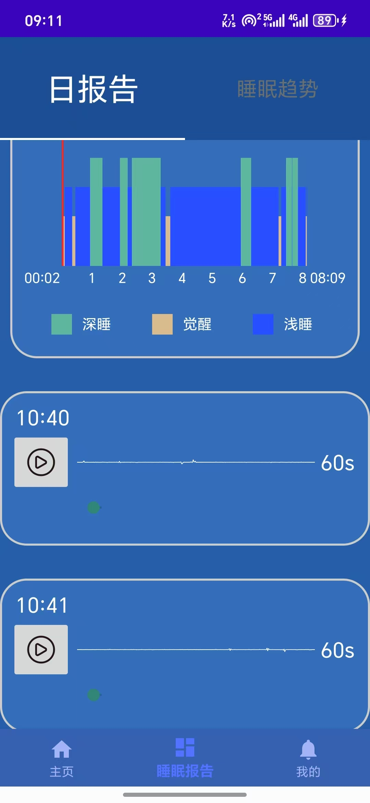

睡眠报告导航栏由Tablayout分为日报告Fragment和睡眠趋势Fragment，展示基本信息、睡眠阶段分布情况和鼾声片段。**这两张图片是一个界面。**

+ 睡眠趋势

 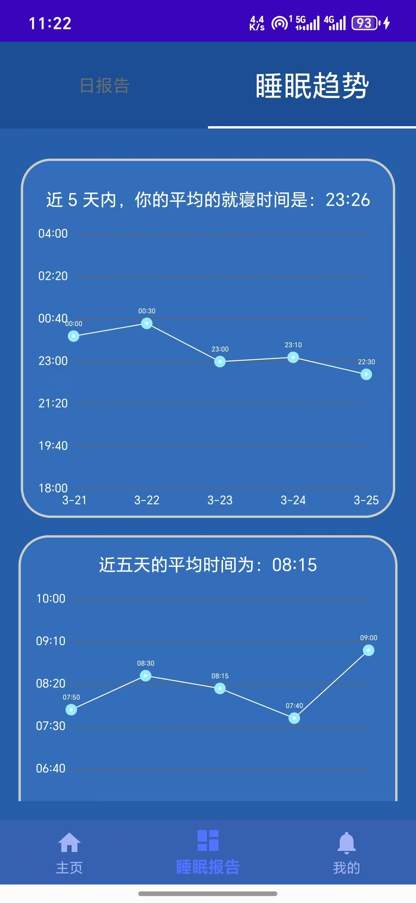
 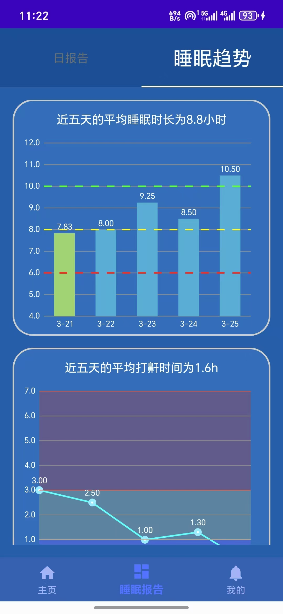

睡眠确实展示近5天内平均**上床**时间，平均**起床**时间，平均**睡眠时长**，平均**鼾声时长**。

### 个人资料

+ 查看指定日期报告

    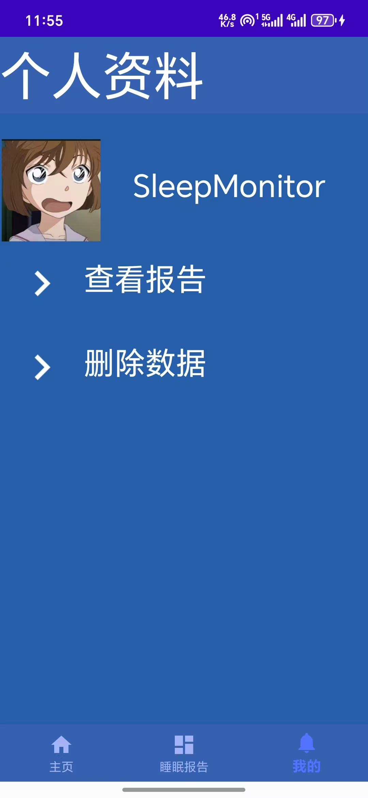
    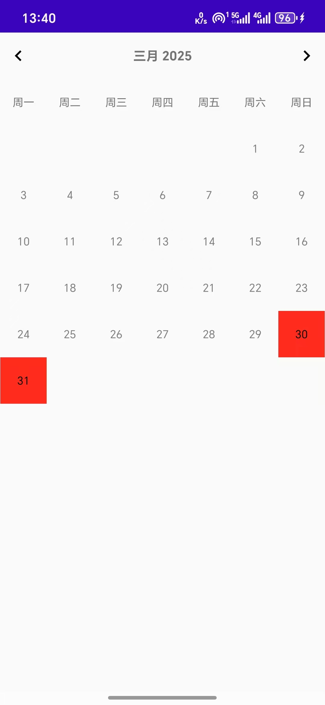
    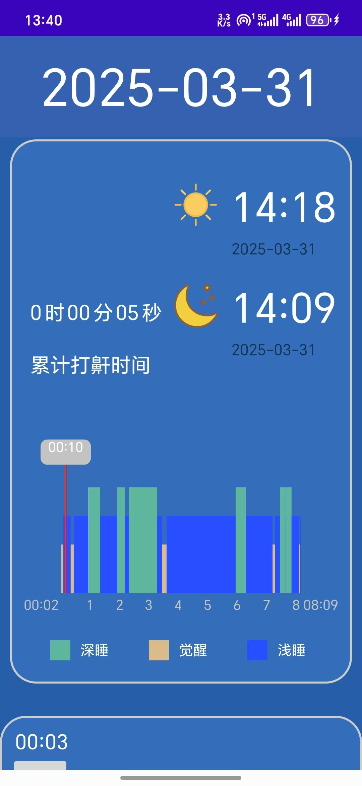

+ 删除数据

    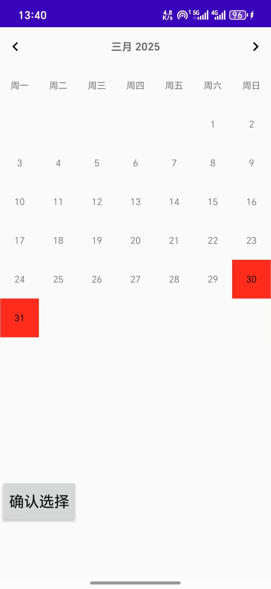
    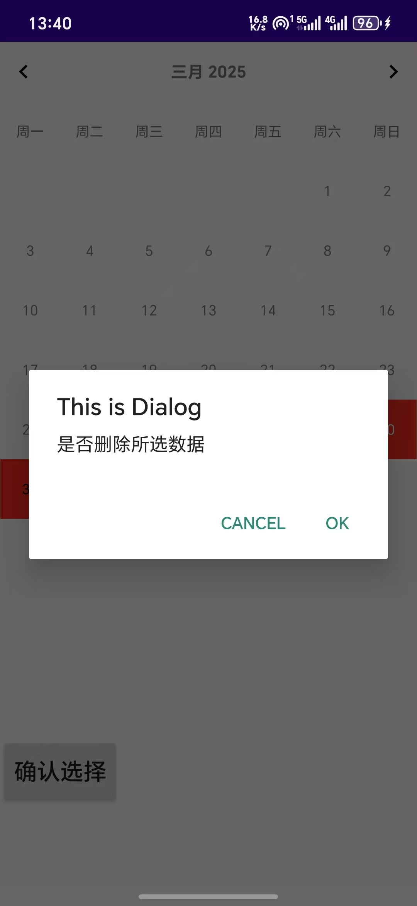
    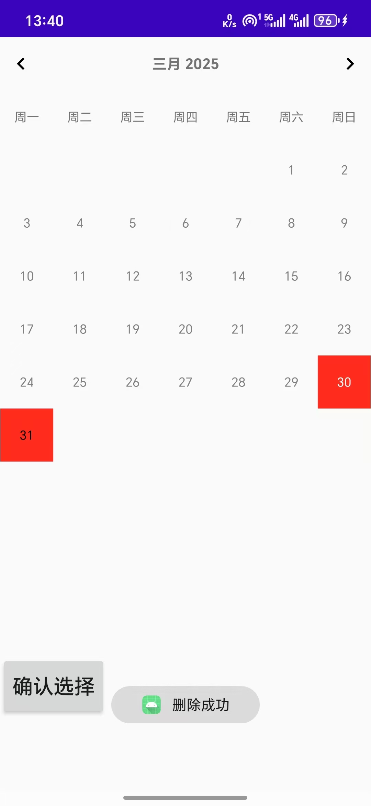

### 闹钟功能

 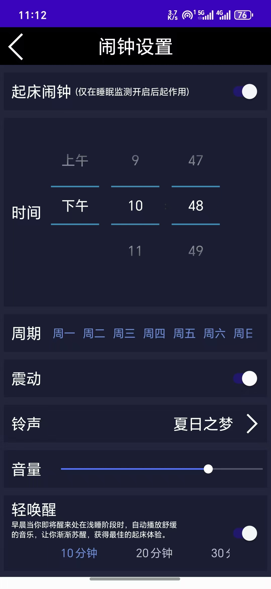
 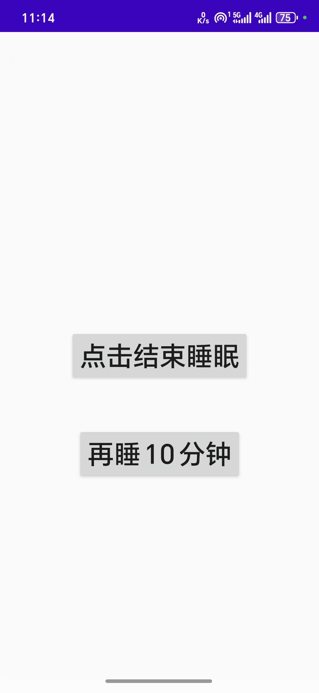

